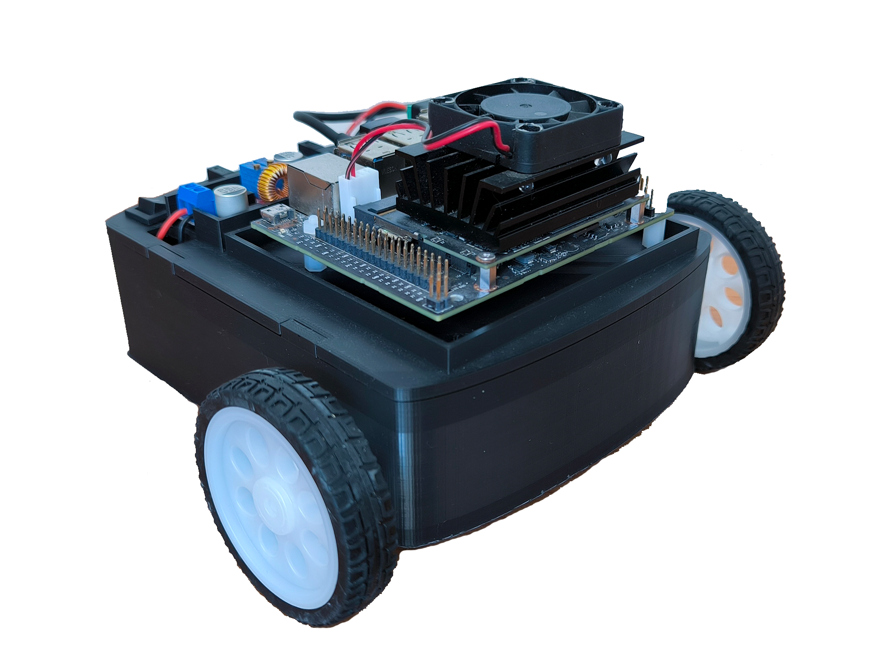

# Educational Mobile Robot Prototype MiniRoby

*Figure: 3D-printed mobile robot prototype based on differential drive.*

This repository contains all the files associated with the article:
**"Construction of an Educational Prototype of a Differential Wheeled Mobile Robot"**  
Authors: Celso Márquez-Sánchez, Jacobo Sandoval-Gutiérrez, and Daniel Librado Martinez-Velazquez
Journal: *Hardware* (MDPI)

##  Project Overview

This project presents a low-cost, 3D-printed mobile robot controlled via an Arduino Nano and Jetson platform. It is designed for educational and research purposes, focusing on differential drive motion, trajectory tracking, and modular hardware.

The repository includes:
- STL files for 3D printing the robot structure (`/stl`)
- Arduino Nano code for motor control (`/arduino`)
- Python scripts for trajectory generation and control on Jetson (`/jetson`)
- Demonstration videos of trajectory execution (`/videos`)

## Prototype in Development
This is an ongoing prototype. The design, code, and control strategies are **continuously evolving and subject to improvement**.
We encourage contributors and readers to check this repository for the **latest updates, fixes, and experimental features**.

## Folder Structure
/stl -> 3D printable files of robot parts
/arduino -> Arduino Nano code for low-level motor control
/jetson -> Python scripts running on Jetson for control and trajectory tracking
/videos -> Demonstration videos of linear, circular, and sinusoidal trajectories
less
Copy
Edit

> Please cite the original publication when using or adapting any part of this project.

---

### Contact
For questions or collaboration opportunities, please contact:  
Celso Márquez-Sánchez – *Universidad Autónoma Metropolitana, México*  
Email: c.marquez@correo.ler.uam.mx
